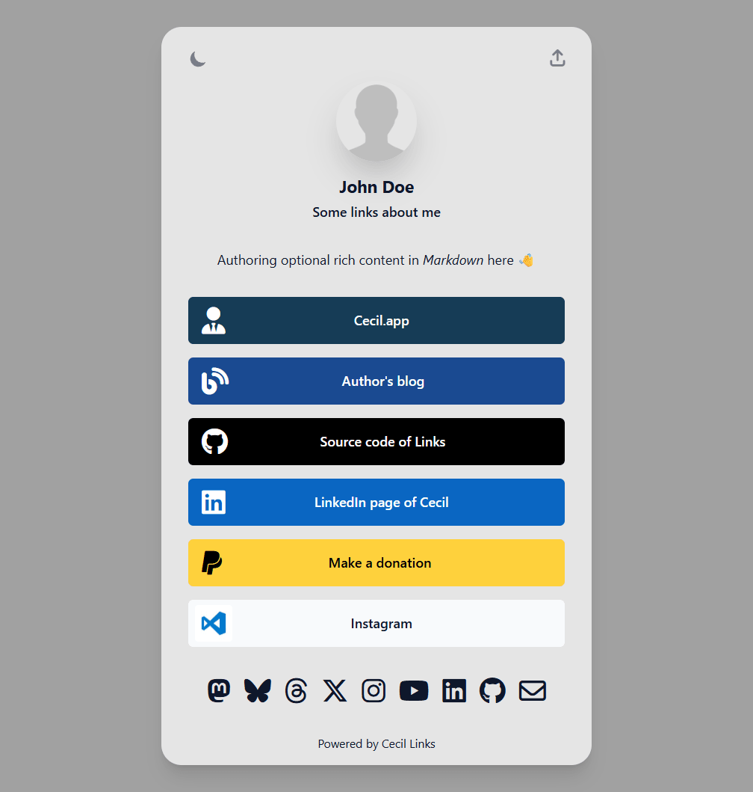

# _Links_ theme

Theme for [Cecil](https://cecil.app), powered by [Tailwind CSS](https://tailwindcss.com) and [Font Awesome](https://fontawesome.com).



## Features

- Template blocks
- Dark mode
- Etc.

## Installation

```bash
composer require cecil/theme-links
```

> Or [download the latest archive](https://github.com/Cecilapp/theme-links/releases/latest/) and uncompress its content in `themes/links`.

## Usage

Add `links` in the `theme` section of the configuration:

```yaml
theme:
  - links
```

### Blocks

The home page is built from the `blocks` array of its _front matter_, each block being rendered by the template `layouts/blocks/<name>.html.twig`:

- `content`: page content (Markdown body)
- `links`: list of links, defined in the block `items`
- `social`: social identities (from `social` configuration)

A block can be used several times, e.g. to display multiple lists of links:

```yaml
---
blocks:
  - name: content
  - name: links
    items:
      - title: <title>
        url: <url>
        color: "<#hexa_code>" # optional
        icon: <style>:<name>  # Font Awesome icon, optional (e.g. "brands:github")
  - name: links
    items:
      - title: <title>
        url: <url>
        image: <path or URL>  # optional, displays an image
      - title: <title>
        video: <path>         # optional, displays a video
  - name: social
---
```

Each links block is rendered as an `<ol class="buttons">` with a unique id (`buttons-<block index>`), and each link has the id `buttons-<block index>-<link index>`.

> If a `links` block has no `items`, the page `links` variable is used as a fallback (backward compatibility).

### Configuration

```yaml
links:
  buttons:
    color: page # use links colors (`page`, default) or CSS colors (`css`)
```

## Customization

Templates only use semantic classes (`.layout`, `.header`, `.avatar`, `.site-title`, `.site-baseline`, `.content`, `.footer`, `.buttons`, `.button`, `.button-link`, `.button-icon`, `.button-favicon`, `.button-title`, `.button-media`, `.social`, `.social-icon`, `.social-<name>`, etc.): their appearance is defined in `assets/tailwind.css` and can be overridden in your own `assets/tailwind.css`.

## Development

### Install `tailwind-builder`

```bash
composer require aligny/tailwind-builder
```

### Rebuild CSS

```bash
vendor/bin/tailwind-builder assets/tailwind.css --minify
```

## License

 _Links_ theme is a free software distributed under the terms of the MIT license.

© [Arnaud Ligny](https://arnaudligny.fr)
